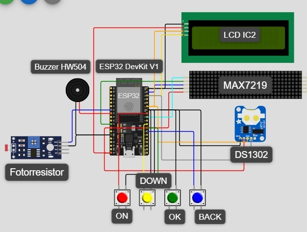

Reloj Digital con MAX7219 y ESP32
Proyecto de un reloj digital multifunción implementado con ESP32 y módulos LED MAX7219, que incluye:
- Reloj en formato 24 horas
- Cronómetro
- Temporizador
- Sistema de alarma
- Menú de configuración mediante botones
El proyecto está diseñado de forma modular, facilitando su mantenimiento, expansión y comprensión.

El proyecto es un reloj digital multifuncional basado en el ESP32 que utiliza un módulo RTC (DS1302) para la hora y matrices MAX7219 para la visualización.

# Reloj Digital con MAX7219 y Arduino

Este repositorio contiene el código fuente de un reloj digital simple implementado en la plataforma Arduino, utilizando el circuito integrado MAX7219 para el control de la visualización en un display de 7 segmentos o matriz de LEDs.

## 1. Concepto del Proyecto

### Propósito

El proyecto funciona como un **Reloj Digital básico**, llevando la cuenta interna del tiempo (Horas, Minutos, y Segundos) y mostrando la hora en un formato legible.

### Mecanismo

El funcionamiento se basa en la comunicación serial entre el Microcontrolador (ESP32 DevKit V1) y el controlador de display MAX7219:

1.  **Microcontrolador (ESP32 DevKit V1):** Actúa como el cerebro. Mantiene la lógica del conteo de tiempo y formatea el valor de la hora en dígitos individuales.
2.  **MAX7219:** Es el controlador de display que recibe los datos de los dígitos vía serial (3 pines: DIN, CLK, LOAD) y se encarga de gestionar la multiplexación de los LEDs para mostrar la hora de forma continua, simplificando el cableado para el Arduino.

### Implementación del Software

El tiempo se gestiona mediante un **temporizador por software** basado en la función `delay(1000)` dentro del bucle principal (`loop()`), que incrementa las variables internas de SEGUNDO, MINUTO y HORA.

## Estructura y Componentes Clave

### Estructura de Archivos

relojMAX7219 (Archivo principal) Contiene todo el código fuente del reloj: la lógica de conteo de tiempo (variables HORA, MINUTO, SEGUNDO), la inicialización del hardware, y las funciones que envían los datos de los dígitos al MAX7219. Es el "Cerebro" del reloj.

### Componentes de Hardware Requeridos

* **Microcontrolador:** ESP32 DevKit V1
* **Módulo de Display:** Módulo de 8x8 o display de 7 segmentos basado en el chip MAX7219.
* **Cableado:** Conexiones de alimentación (VCC, GND) y Pines de control serial (DIN, CLK, LOAD).


## 3. Funcionamiento del Código (`relojMAX7219.ino`)

El código utiliza la librería `LedControl.h` para interactuar con el MAX7219.

### 3.1. Librerías y Conexión

Se utiliza la librería `LedControl.h`, que permite controlar el MAX7219 con funciones simples.

```cpp
#include "LedControl.h"
// Conexión Típica: (DIN, CLK, LOAD, Número de matrices)
LedControl lc = LedControl(12, 11, 10, 1);
```


