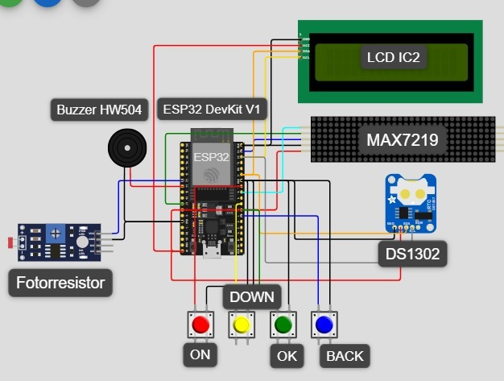

Reloj Digital con MAX7219 y ESP32
Proyecto de un reloj digital multifunción implementado con ESP32 y módulos LED MAX7219, que incluye:
- Reloj en formato 24 horas
- Cronómetro
- Temporizador
- Sistema de alarma
- Menú de configuración mediante botones
El proyecto está diseñado de forma modular, facilitando su mantenimiento, expansión y comprensión.

## Diagrama de Conexión



El proyecto es un reloj digital multifuncional basado en el ESP32 que utiliza un módulo RTC (DS1302) para la hora y matrices MAX7219 para la visualización.

# Reloj Digital con MAX7219 y Arduino

Este repositorio contiene el código fuente de un reloj digital simple implementado en la plataforma Arduino, utilizando el circuito integrado MAX7219 para el control de la visualización en un display de 7 segmentos o matriz de LEDs.

## 1. Concepto del Proyecto

### Propósito

El proyecto funciona como un **Reloj Digital básico**, llevando la cuenta interna del tiempo (Horas, Minutos, y Segundos) y mostrando la hora en un formato legible.

### Mecanismo

El funcionamiento se basa en la comunicación serial entre el Microcontrolador (ESP32 DevKit V1) y el controlador de display MAX7219:

1.  **Microcontrolador (ESP32 DevKit V1):** Actúa como el cerebro. Mantiene la lógica del conteo de tiempo y formatea el valor de la hora en dígitos individuales.
2.  **MAX7219:** Es el controlador de display que recibe los datos de los dígitos vía serial (3 pines: DIN, CLK, LOAD) y se encarga de gestionar la multiplexación de los LEDs para mostrar la hora de forma continua, simplificando el cableado para el Arduino.

### Implementación del Software

El tiempo se gestiona mediante un **temporizador por software** basado en la función `delay(1000)` dentro del bucle principal (`loop()`), que incrementa las variables internas de SEGUNDO, MINUTO y HORA.

## Estructura y Componentes Clave

### Estructura de Archivos

relojMAX7219 (Archivo principal) Contiene todo el código fuente del reloj: la lógica de conteo de tiempo (variables HORA, MINUTO, SEGUNDO), la inicialización del hardware, y las funciones que envían los datos de los dígitos al MAX7219. Es el "Cerebro" del reloj.

### Componentes de Hardware Requeridos

* **Microcontrolador:** ESP32 DevKit V1
* **Módulo de Display:** Módulo de 8x8 o display de 7 segmentos basado en el chip MAX7219.
* **Cableado:** Conexiones de alimentación (VCC, GND) y Pines de control serial (DIN, CLK, LOAD).


## 3. Funcionamiento del Código (`relojMAX7219.ino`)

El código utiliza la librería `LedControl.h` para interactuar con el MAX7219.

### 3.1. Librerías y Conexión

Se utiliza la librería `LedControl.h`, que permite controlar el MAX7219 con funciones simples.

```cpp
#include "LedControl.h"
// Conexión Típica: (DIN, CLK, LOAD, Número de matrices)
LedControl lc = LedControl(12, 11, 10, 1);
```

# ⌚ Reloj Digital Multifunción MAX7219 con ESP32 y Wi-Fi

Este repositorio alberga el firmware para un proyecto de reloj digital avanzado y multifuncional, diseñado para ser ejecutado en la placa de desarrollo **ESP32 DevKit V1**. El proyecto supera la función básica de un reloj al integrar modos de operación avanzados, conectividad inalámbrica y una interfaz de usuario completa. La arquitectura del software está diseñada para ser modular y escalable.

## 🚀 Características Principales del Proyecto

| Característica | Descripción | Componentes Relevantes |
| :--- | :--- | :--- |
| **Reloj en 24 Horas** | Muestra la hora precisa (HH:MM:SS) en formato de 24 horas. | MAX7219, RTC DS102, NTP. |
| **Sincronización NTP** | Utiliza el MODO Wi-Fi para obtener y corregir la hora del \textbf{RTC DS102} mediante el Network Time Protocol. | ESP32, Conexión Wi-Fi. |
| **Cronómetro y Temporizador** | Funciones independientes para medir o contar regresivamente el tiempo. Controlables vía botones o interfaz web. | ESP32 (Temporizadores internos). |
| **Sistema de Alarma** | Permite configurar una hora de alarma persistente, que activa el \textbf{Buzzer HW405} al coincidir con la hora actual. | RTC DS102, Buzzer HW405, Memoria NVS/EEPROM. |
| **Menú de Configuración** | Interfaz local mediante botones y la \textbf{Pantalla LCD I2C} para la configuración de modos, alarmas y Wi-Fi. | Pantalla LCD I2C, Botones. |
| **Control Remoto (Wi-Fi)** | El ESP32 actúa como un Servidor Web, permitiendo la configuración remota de la alarma y el control del cronómetro desde un navegador. | ESP32 (Servidor HTTP). |

## 🛠️ Componentes de Hardware Requeridos

Este proyecto requiere los siguientes módulos de hardware para su implementación completa:

* **Microcontrolador:** ESP32 DevKit V1 (Cerebro del sistema y conectividad Wi-Fi).
* **Display Principal:** Módulo de display de 7 segmentos o matriz de LEDs controlado por el chip **MAX7219** (Comunicación SPI).
* **Reloj de Tiempo Real (RTC):** Módulo \textbf{DS102} (Mantiene la hora precisa y persistente).
* **Interfaz de Usuario:** Pantalla \textbf{LCD I2C} (Para el menú y la configuración).
* **Audio:** \textbf{Buzzer HW405} (Para notificaciones de alarma).
* **Entrada:** Botones físicos y Fuente de alimentación.


## 💻 Estructura del Software y Modularidad

El código sigue una estructura modular para facilitar su mantenimiento y comprensión, basada en la separación de interfaces y su implementación:

### 1. Relación entre Carpetas `include` y `src`

| Carpeta | Contenido | Función en el Proyecto |
| :--- | :--- | :--- |
| **`include`** | Archivos de Encabezado (`.h`, `.hpp`). | Define las **interfaces (declaraciones)** de las funciones, estructuras y constantes utilizadas (ej. configuración de pines, definición de la clase `Alarm`). |
| **`src`** | Archivos de Implementación (`.cpp`). | Contiene la **lógica funcional (implementación)** real. Aquí se define cómo interactuar con el MAX7219, la lógica de los modos de cronómetro, y la gestión del servidor web. |

Esta estructura asegura que el archivo principal de ejecución (`main.cpp`) solo necesite conocer las interfaces, delegando los detalles de bajo nivel a los archivos en `src`.

### 2. Lógica de Modos Operativos

El núcleo del firmware gestiona los diferentes modos operativos a través de una **Máquina de Estados Finita (FSM)**:

#### 2.1. Modo de Reloj y Sincronización

1.  **Obtención de Tiempo:** El sistema prioriza la lectura del \textbf{RTC DS102}.
2.  **Sincronización:** Si el Wi-Fi está activo, se realiza una consulta al servidor \textbf{NTP}. Si la consulta es exitosa, se utiliza esa hora de alta precisión para **corregir y actualizar el RTC**.
3.  **Visualización:** El tiempo (HH:MM:SS) se formatea ($0 \leq H \leq 23$) y se envía continuamente al \textbf{MAX7219} a través de la comunicación SPI.

#### 2.2. Modo de Alarma

La alarma se configura y almacena en memoria persistente (NVS/EEPROM). La lógica de comparación es continua:

$$\text{IF } (H_{actual} = H_{alarma}) \land (M_{actual} = M_{alarma}) \text{ THEN ACTIVATE BUZZER}$$

La coincidencia activa el \textbf{Buzzer HW405} mediante una señal digital modulada hasta que se desactiva por interacción del usuario.

#### 2.3. MODO Wi-Fi y Control Remoto

El modo Wi-Fi es fundamental para la precisión y la accesibilidad:

* **Conectividad:** Se utiliza el ESP32 para establecer una conexión a la red local.
* **Servidor Web:** Se inicializa un \textbf{Servidor HTTP} accesible mediante la dirección IP local del ESP32.
* **Funciones Remotas:** El servidor permite al usuario:
    * Sincronizar o ajustar manualmente el RTC.
    * Configurar la alarma de forma cómoda.
    * Controlar los estados del cronómetro (\texttt{Start}/\texttt{Stop}/\texttt{Reset}).

## ⚙️ Implementación del Display (MAX7219)

El control del display se realiza utilizando la librería **`LedControl.h`** (o su equivalente en el framework ESP-IDF).

* **Comunicación:** El ESP32 se comunica con el MAX7219 a través de la interfaz serial de 3 pines (DIN, CLK, LOAD).
* **Lógica:** El código es responsable de tomar los valores de la hora y transformarlos en los comandos que el MAX7219 necesita para encender los segmentos o LEDs correspondientes.

```cpp
#include "LedControl.h"
// Conexión Típica: (DIN, CLK, LOAD, Número de matrices)
LedControl lc = LedControl(DIN_PIN, CLK_PIN, LOAD_PIN, 1);
